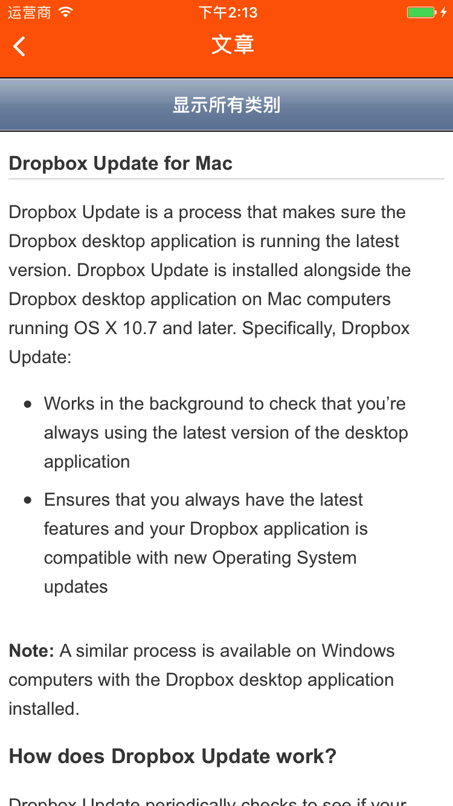
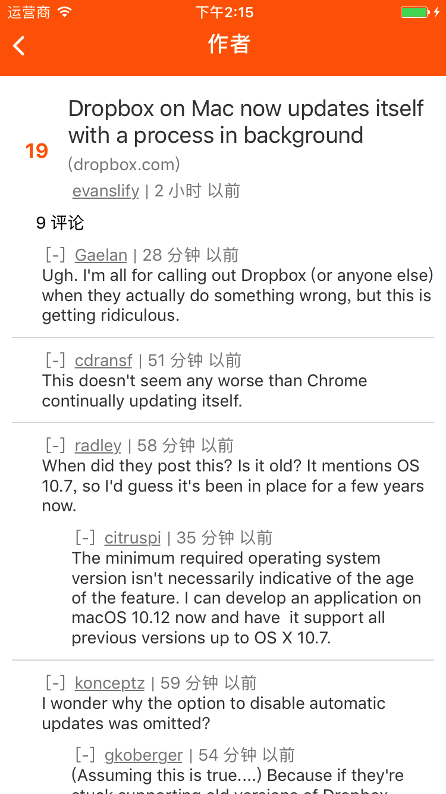

#  RN-HackerNews

使用 ReactNative 重写 Weex 团队的 [weex-hackernews](https://github.com/weexteam/weex-hackernews/)，基于  [Ignite](https://github.com/infinitered/ignite) 进行构建。

## 截图

  
  

## 如何安装

执行以下命令

1. `git clone https://github.com/SidneyXu/RN-HackerNews`
2. `cd HackerNews`
3. `npm install`

## 如何运行

- 运行 iOS 项目
  - `react-native run-ios`
- 运行 Android 项目
  - 先运行模拟器
  - `react-native run-android`

## 项目依赖

以下依赖基本上都是 Ignite 提供的，已经可以适用于大部分的开发工作

  - Ignite	ReactNative 的脚手架工具，可以生成工程模板，通过命令行添加各种组件
  - apisauce  一个客户端网络请求框架
  - lodash  前端工具库
    - lamda 函数式编程工具库
  - react-native-animatable  动画库
    - react-native-i18n  多语言库，可以非常方便地实现多语言
    - react-native-vector-icons  图标库，非常实用
  - redux-loggerRedux  日志输出工具，一般就调试时用，会非常影响渲染效率
  - redux-sagaRedux  异步调用工具，与 redux-thunk 相比入手难度较高
  - react-native-router-fluxReactNative  路由跳转支持
  - reactotron-react-native  Ignite 出品的调试工具，个人觉得未必比 Redux-Tool 好用

[list]:	capture/1.png
[article]:	capture/2.png
[comment]:	capture/3.png
[author]: capture/4.png
